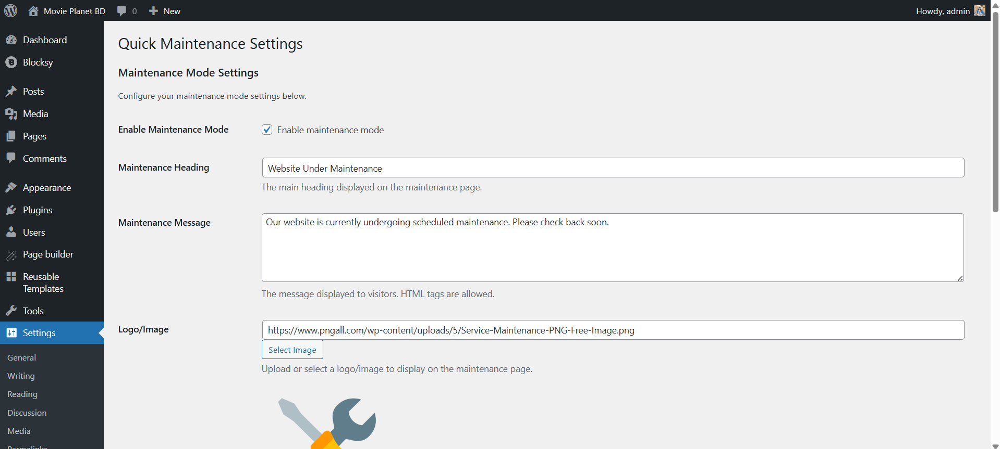

# Quick Maintenance

A lightweight plugin to quickly enable a sleek maintenance mode, hiding your site work from visitors.  

---

## 📝 Plugin Info
- **Contributors:** [bytesvibe](https://github.com/bytesvibe)  
- **Tags:** maintenance, coming soon, under construction, utility, responsive  
- **Requires at least:** WordPress 5.0  
- **Tested up to:** 6.8  
- **Requires PHP:** 7.4  
- **Stable tag:** 1.0.0  
- **License:** GPLv2 or later  
- **License URI:** [GNU GPL v2](https://www.gnu.org/licenses/gpl-2.0.html)  

---

## ✨ Features
- Easy one-click activation/deactivation  
- Custom heading & message (HTML supported)  
- Logo/image upload with media library integration  
- **Multiple color presets** for background gradients  
- Modern, responsive design with animations  
- IP whitelist support (bypass maintenance mode)  
- Automatic bypass for logged-in admins  
- Proper HTTP 503 status code for SEO  
- Translation ready (`.pot` file included)  
- Lightweight & fast  

### 🎨 Enhanced Visual Features
- Gradient background designs  
- Glassmorphism effect with backdrop blur  
- Smooth animations and transitions  
- Clean centered layout  
- Professional typography  
- Fully mobile-friendly  

---

## ⚙️ How It Works
When enabled, all visitors (except whitelisted IPs and logged-in admins) will see a responsive maintenance page with your custom content. The plugin serves a proper **HTTP 503 status code**, letting search engines know the downtime is temporary.

---

## 📥 Installation
1. Upload the plugin files to `/wp-content/plugins/quick-maintenance/` or install via the WordPress plugins screen.  
2. Activate the plugin from **Plugins → Installed Plugins**.  
3. Configure settings under **Settings → Maintenance Mode**.  

---

## ❓ FAQ

**Q: How do I enable maintenance mode?**  
A: Go to **Settings → Maintenance Mode**, check "Enable Maintenance Mode," then save settings.  

**Q: Can I customize the message and heading?**  
A: Yes, both fields are customizable and support HTML.  

**Q: How do I add a logo?**  
A: Use the "Select Image" button to upload/select from your media library.  

**Q: Can I whitelist users?**  
A: Add IPs (comma-separated) in the Whitelist field. Logged-in admins bypass automatically.  

**Q: Is it SEO safe?**  
A: Yes, the plugin returns HTTP 503 (recommended for search engines).  

**Q: Is it responsive?**  
A: Yes, fully mobile-friendly.  

**Q: Translation support?**  
A: Yes, `.pot` file provided in `languages/`.  

---

## 📸 Screenshots
1. Settings page in WordPress admin  
2. Maintenance page (desktop)  
3. Mobile view  
4. Logo upload interface  
5. Color preset selector  

---

## 📦 Changelog

### 1.0.0
- Initial release  
- Maintenance mode with custom message, heading, and logo  
- IP whitelist & admin bypass  
- Gradient background & glassmorphism effect  
- Responsive design with animations  
- Current IP display for whitelisting  
- Translation ready  

---

## 🔔 Upgrade Notice
**1.0.0** — First release of Quick Maintenance 🎉  

---

## 📄 License
This plugin is licensed under the [GPLv2 or later](https://www.gnu.org/licenses/gpl-2.0.html).  
